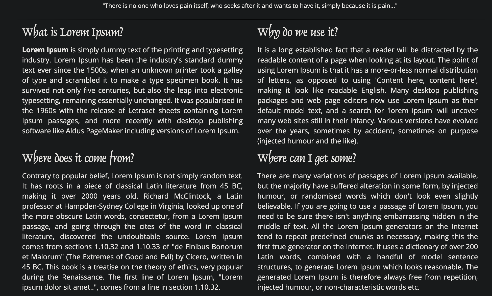
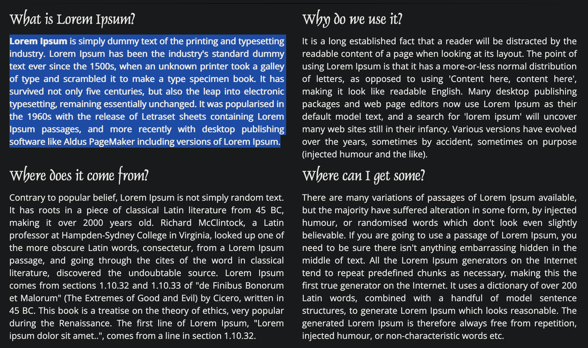

# Bold Highlighter Chrome Extension

A Chrome extension that enhances your reading experience by making selected text bold and more prominent.

## Features

- Makes any selected text bold for better readability
- Toggle the extension on/off with a single click
- Works across all websites
- Lightweight and fast
- No tracking or data collection

## Installation

### From Chrome Web Store (Recommended)
1. Visit the [Chrome Web Store](https://chrome.google.com/webstore)
2. Search for "Bold Highlighter"
3. Click "Add to Chrome"
4. Confirm the installation

### Manual Installation
1. Download or clone this repository
2. Open Chrome and go to `chrome://extensions/`
3. Enable "Developer mode" in the top right corner
4. Click "Load unpacked" and select the directory containing this extension
5. The extension should now be active

## How to Use

1. Click the Bold Highlighter icon in your Chrome toolbar to open the popup
2. Toggle the switch to enable/disable the extension
3. Select any text on any webpage to make it bold
4. The bold formatting will remain until you refresh the page

## Permissions

This extension requires the following permissions:
- `activeTab`: To access and modify the content of the current tab
- `storage`: To save your preference for the extension's on/off state

## Privacy Policy

This extension does not:
- Collect any personal information
- Track your browsing activity
- Store any data about the text you select
- Share any information with third parties

## Support

For support or to report issues, please [open an issue](https://github.com/sebzuddas/bold-highlighter/issues) on GitHub.## Demo

### Before

### After

## License

This project is licensed under the MIT License - see the [LICENSE](LICENSE) file for details.

## Version History

- 1.0.0
  - Initial release
  - Basic bold highlighting functionality
  - Toggle on/off feature
  - Persistent settings

## Contributing

Contributions are welcome! Please feel free to submit a Pull Request.
